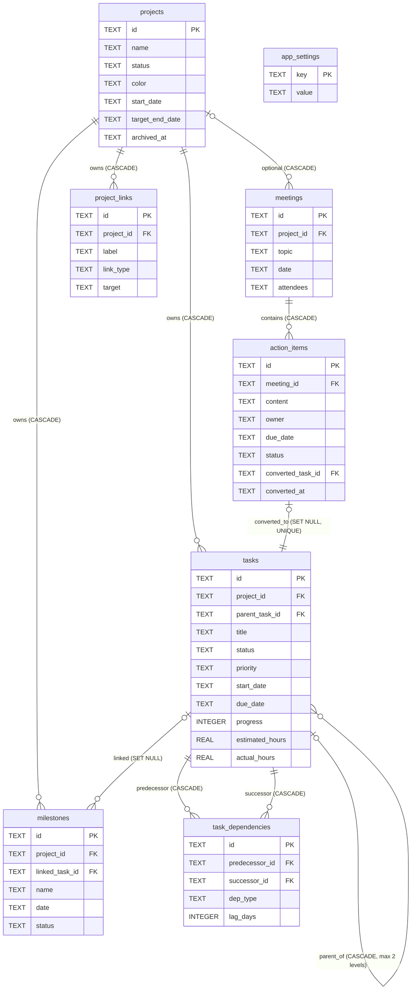

# ProjectPilot 数据库设计（SQLite）

## 1. 全局约定

| 约定 | 内容 |
|---|---|
| 主键 | `id TEXT PRIMARY KEY`，UUID v4（前端 `crypto.randomUUID()` 生成）。跨库导入导出稳定、离线生成无需回读 |
| 时间戳 | 每表 `created_at TEXT NOT NULL`、`updated_at TEXT NOT NULL`，UTC ISO-8601（`YYYY-MM-DDTHH:mm:ssZ`） |
| 业务日期 | `TEXT 'YYYY-MM-DD'`（date-only，语义为香港日历日），配 `CHECK(x GLOB '____-__-__')`；字典序 = 日期序，可直接 ORDER BY/BETWEEN |
| 布尔 | INTEGER 0/1 + `CHECK(x IN (0,1))` |
| 外键 | 全部声明；每个连接执行 `PRAGMA foreign_keys = ON`（SQLite 默认关闭），应用启动断言生效 |
| 示例数据 | 业务表带 `is_sample INTEGER NOT NULL DEFAULT 0`，一键清除 = 单事务 `DELETE ... WHERE is_sample=1` |
| Migration | tauri-plugin-sql Migration（version + up/down SQL），SQL 文件外置于 `src-tauri/migrations/`，幂等 |
| 存放位置 | Tauri app data directory（如 `%APPDATA%/com.projectpilot.app/projectpilot.db`），绝不放源码目录 |

## 2. 表定义

### 2.1 projects

| 字段 | 类型 | 约束 |
|---|---|---|
| id | TEXT | PK (UUID) |
| name | TEXT | NOT NULL, CHECK(length(trim(name)) BETWEEN 1 AND 120) |
| description | TEXT | NOT NULL DEFAULT '' |
| status | TEXT | NOT NULL DEFAULT 'active', CHECK(status IN ('active','on_hold','completed','archived')) |
| color | TEXT | NOT NULL DEFAULT '#2563EB', CHECK(color GLOB '#[0-9A-Fa-f][0-9A-Fa-f][0-9A-Fa-f][0-9A-Fa-f][0-9A-Fa-f][0-9A-Fa-f]') |
| start_date | TEXT | NULL, CHECK(start_date IS NULL OR start_date GLOB '____-__-__') |
| target_end_date | TEXT | NULL, 同上格式 CHECK；CHECK(start_date IS NULL OR target_end_date IS NULL OR start_date <= target_end_date) |
| archived_at | TEXT | NULL（归档时间，NULL=未归档；替代单独布尔，含审计信息） |
| is_sample | INTEGER | NOT NULL DEFAULT 0, CHECK(is_sample IN (0,1)) |
| created_at / updated_at | TEXT | NOT NULL |

索引：`idx_projects_status(status)`、`idx_projects_archived(archived_at)`

### 2.2 tasks

| 字段 | 类型 | 约束 |
|---|---|---|
| id | TEXT | PK |
| project_id | TEXT | NOT NULL, FK→projects(id) **ON DELETE CASCADE** |
| parent_task_id | TEXT | NULL, FK→tasks(id) **ON DELETE CASCADE**（删父删子，两层语义一致） |
| title | TEXT | NOT NULL, CHECK(length(trim(title)) BETWEEN 1 AND 160) |
| description | TEXT | NOT NULL DEFAULT '' |
| status | TEXT | NOT NULL DEFAULT 'todo', CHECK(status IN ('todo','in_progress','blocked','done','cancelled')) |
| priority | TEXT | NOT NULL DEFAULT 'medium', CHECK(priority IN ('low','medium','high','urgent')) |
| start_date | TEXT | NULL, 日期格式 CHECK |
| due_date | TEXT | NULL, 日期格式 CHECK；CHECK(start_date IS NULL OR due_date IS NULL OR start_date <= due_date) |
| progress | INTEGER | NOT NULL DEFAULT 0, CHECK(progress BETWEEN 0 AND 100) |
| estimated_hours | REAL | NULL, CHECK(estimated_hours IS NULL OR estimated_hours >= 0) |
| actual_hours | REAL | NULL, CHECK(actual_hours IS NULL OR actual_hours >= 0) |
| is_sample | INTEGER | NOT NULL DEFAULT 0 |
| created_at / updated_at | TEXT | NOT NULL |

索引：`idx_tasks_project_status(project_id, status)`、`idx_tasks_project_due(project_id, due_date)`、`idx_tasks_parent(parent_task_id)`、`idx_tasks_dashboard(status, due_date, progress)`（Dashboard 今日/本周/逾期/临期低进度均命中）

**两层父子限制（触发器兜底 + service 校验）**：

```sql
CREATE TRIGGER trg_tasks_max_two_levels
BEFORE INSERT ON tasks
WHEN NEW.parent_task_id IS NOT NULL AND (
  SELECT parent_task_id FROM tasks WHERE id = NEW.parent_task_id
) IS NOT NULL
BEGIN
  SELECT RAISE(ABORT, 'MAX_TWO_LEVELS');
END;
-- 同逻辑再建 BEFORE UPDATE OF parent_task_id 触发器；
-- 另建触发器禁止"已有子任务的任务"再获得父任务
```

业务规则（service 层，不在 DB）：done→progress=100；cancelled 不计入完成率。

### 2.3 task_dependencies（finish-to-start）

| 字段 | 类型 | 约束 |
|---|---|---|
| id | TEXT | PK |
| predecessor_id | TEXT | NOT NULL, FK→tasks(id) **ON DELETE CASCADE** |
| successor_id | TEXT | NOT NULL, FK→tasks(id) **ON DELETE CASCADE** |
| dep_type | TEXT | NOT NULL DEFAULT 'FS', CHECK(dep_type IN ('FS'))（第一版仅 FS，预留扩展） |
| lag_days | INTEGER | NOT NULL DEFAULT 0（预留；第一版 UI 不暴露） |
| created_at / updated_at | TEXT | NOT NULL |

约束：`UNIQUE(predecessor_id, successor_id)`（禁重复边）、`CHECK(predecessor_id <> successor_id)`（禁自环）
索引：UNIQUE 自带 + `idx_deps_successor(successor_id)`（反向遍历）
循环检测在前端（Kahn/DFS），加边前防环；跨项目依赖 UI 禁止创建，检测层对存量警示。

### 2.4 milestones

| 字段 | 类型 | 约束 |
|---|---|---|
| id | TEXT | PK |
| project_id | TEXT | NOT NULL, FK→projects(id) **ON DELETE CASCADE** |
| linked_task_id | TEXT | NULL, FK→tasks(id) **ON DELETE SET NULL**（可选关联任务；任务删除不误伤 milestone） |
| name | TEXT | NOT NULL, CHECK(length(trim(name)) BETWEEN 1 AND 120) |
| description | TEXT | NOT NULL DEFAULT '' |
| date | TEXT | NOT NULL, 日期格式 CHECK |
| status | TEXT | NOT NULL DEFAULT 'upcoming', CHECK(status IN ('upcoming','achieved','missed','cancelled')) |
| achieved_at | TEXT | NULL（达成时间，审计） |
| is_sample | INTEGER | NOT NULL DEFAULT 0 |
| created_at / updated_at | TEXT | NOT NULL |

索引：`idx_milestones_project_date(project_id, date)`、`idx_milestones_status_date(status, date)`、`idx_milestones_task(linked_task_id)`
规则：关联任务完成时仅提示，状态永不自动改（service 层保证）。若未来需要多任务关联，新增 `milestone_task_links` 关联表迁移，不破坏现有字段。

### 2.5 meetings

| 字段 | 类型 | 约束 |
|---|---|---|
| id | TEXT | PK |
| project_id | TEXT | NULL, FK→projects(id) **ON DELETE CASCADE**（可独立存在→可空；随项目永久删除级联，删除确认框中明示） |
| topic | TEXT | NOT NULL, CHECK(length(trim(topic)) BETWEEN 1 AND 160) |
| date | TEXT | NOT NULL, 日期格式 CHECK |
| attendees | TEXT | NOT NULL DEFAULT '[]'（JSON 字符串数组） |
| agenda | TEXT | NOT NULL DEFAULT '' |
| notes | TEXT | NOT NULL DEFAULT ''（讨论记录） |
| decisions | TEXT | NOT NULL DEFAULT '' |
| risks | TEXT | NOT NULL DEFAULT ''（风险/阻塞项） |
| is_sample | INTEGER | NOT NULL DEFAULT 0 |
| created_at / updated_at | TEXT | NOT NULL |

索引：`idx_meetings_project_date(project_id, date)`、`idx_meetings_date(date)`

### 2.6 action_items

| 字段 | 类型 | 约束 |
|---|---|---|
| id | TEXT | PK |
| meeting_id | TEXT | NOT NULL, FK→meetings(id) **ON DELETE CASCADE** |
| content | TEXT | NOT NULL, CHECK(length(trim(content)) BETWEEN 1 AND 300) |
| owner | TEXT | NOT NULL DEFAULT ''（负责人） |
| due_date | TEXT | NULL, 日期格式 CHECK |
| status | TEXT | NOT NULL DEFAULT 'open', CHECK(status IN ('open','in_progress','done','cancelled')) |
| converted_task_id | TEXT | NULL, **UNIQUE**, FK→tasks(id) **ON DELETE SET NULL** |
| converted_at | TEXT | NULL（转换时间；任务被删后仍非空，保持"已转换"语义，防重复转换） |
| created_at / updated_at | TEXT | NOT NULL |

索引：`idx_action_items_meeting(meeting_id)`、UNIQUE(converted_task_id) 自带索引

**防重复转换（三层防御）**：
1. `UNIQUE(converted_task_id)`：一个任务只能对应一个行动项
2. 判定"已转换" = `converted_at IS NOT NULL`（即使任务被删 SET NULL 也不重开转换）
3. 转换 = Rust 原子命令单事务：`INSERT tasks` → `UPDATE action_items SET converted_task_id=?, converted_at=? WHERE id=? AND converted_at IS NULL`；rowsAffected=0 则整体回滚并提示"已转换"

**双向关联**：正向 `action_items.converted_task_id`；反向查询 `SELECT * FROM action_items WHERE converted_task_id = ?`。单向可写、双向可查，杜绝双写不一致（不加 `tasks.source_action_item_id` 冗余列，YAGNI）。

### 2.7 project_links

| 字段 | 类型 | 约束 |
|---|---|---|
| id | TEXT | PK |
| project_id | TEXT | NOT NULL, FK→projects(id) **ON DELETE CASCADE** |
| label | TEXT | NOT NULL, CHECK(length(trim(label)) BETWEEN 1 AND 160) |
| link_type | TEXT | NOT NULL, CHECK(link_type IN ('url','file_path')) |
| target | TEXT | NOT NULL, CHECK(length(trim(target)) > 0)（URL 或本地路径，不存文件本体） |
| is_sample | INTEGER | NOT NULL DEFAULT 0 |
| created_at / updated_at | TEXT | NOT NULL |

索引：`idx_links_project(project_id)`
打开前校验：file_path 用 Rust command 检查存在性，不存在提示并提供复制；url 仅 http/https 可打开。

### 2.8 app_settings（键值）

| 字段 | 类型 | 约束 |
|---|---|---|
| key | TEXT | PK |
| value | TEXT | NOT NULL（JSON 字符串或原子值） |
| created_at / updated_at | TEXT | NOT NULL |

推荐 key：`theme`（dark/light/system）、`sample_data_seeded_at`、`last_backup_at`、`week_starts_on`。恢复数据库时整体替换，UI 不提供批量清空。

## 3. Mermaid ER 图



## 4. 删除 / 归档规则总表

| 操作 | 行为 | 确认 |
|---|---|---|
| 项目归档 | `archived_at = now`；可恢复；数据全保留 | 单次确认 |
| 项目恢复 | `archived_at = NULL` | 无需确认 |
| 项目永久删除 | Rust 原子事务：级联删 tasks（含子任务与依赖边）、milestones、meetings（含 action_items）、project_links | **二次确认**（明示各表将删数量） |
| 任务删除 | 级联删子任务 + 相关依赖边；关联 action_item 的 converted_task_id SET NULL（converted_at 保留）；关联 milestone 的 linked_task_id SET NULL | 有子任务/依赖时二次确认 |
| 会议删除 | 级联删 action_items（已转换任务不受影响） | 二次确认 |
| 里程碑/链接/行动项删除 | 直接删除 | 单次确认 |
| 清除示例数据 | 单事务删除所有 is_sample=1 行 | 二次确认 |
| 恢复数据库 | 自动备份当前库 → 二次确认 → 替换文件 → 重建连接 | **二次确认** |
| JSON 导入 | Zod 校验 → 预览统计 → 单事务全量替换，失败回滚 | **二次确认** |

## 5. Migration 策略

- `src-tauri/migrations/0001_init.sql`：8 张表 + 索引 + 触发器（一次性建全）
- 每个 migration 幂等（CREATE TABLE IF NOT EXISTS 风格不用于变更，版本号单调递增，插件按 version 执行一次）
- Down SQL 仅用于开发期回滚；发布后只前进不后退
- schema 版本随 JSON 导出携带，导入时校验兼容性
- 示例数据不放 migration，由 service 层种子函数按需插入（is_sample=1）
