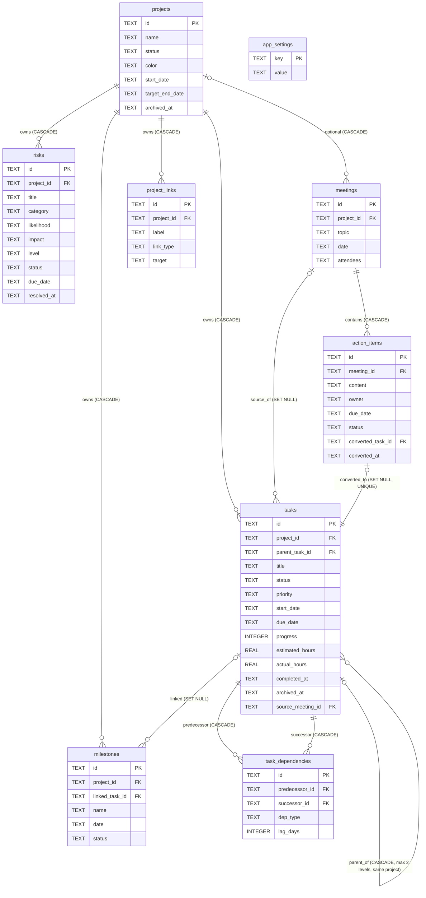

# ProjectPilot 数据库设计（SQLite）

## 1. 全局约定

| 约定      | 内容                                                                                                                          |
| --------- | ----------------------------------------------------------------------------------------------------------------------------- |
| 主键      | `id TEXT PRIMARY KEY`，UUID v4（前端 `crypto.randomUUID()` 生成）。跨库导入导出稳定、离线生成无需回读                         |
| 时间戳    | 每表 `created_at TEXT NOT NULL`、`updated_at TEXT NOT NULL`，UTC ISO-8601（`YYYY-MM-DDTHH:mm:ssZ`）                           |
| 业务日期  | `TEXT 'YYYY-MM-DD'`（date-only，语义为香港日历日），配 `CHECK(x GLOB '____-__-__')`；字典序 = 日期序，可直接 ORDER BY/BETWEEN |
| 布尔      | INTEGER 0/1 + `CHECK(x IN (0,1))`                                                                                             |
| 外键      | 全部声明；每个连接执行 `PRAGMA foreign_keys = ON`（SQLite 默认关闭），应用启动断言生效                                        |
| 示例数据  | 业务表带 `is_sample INTEGER NOT NULL DEFAULT 0`，一键清除 = 单事务 `DELETE ... WHERE is_sample=1`                             |
| Migration | tauri-plugin-sql Migration（version + up/down SQL），SQL 文件外置于 `src-tauri/migrations/`，幂等                             |
| 存放位置  | Tauri app data directory（如 `%APPDATA%/com.projectpilot.app/projectpilot.db`），绝不放源码目录                               |

## 2. 表定义

### 2.1 projects

| 字段                    | 类型    | 约束                                                                                                                |
| ----------------------- | ------- | ------------------------------------------------------------------------------------------------------------------- |
| id                      | TEXT    | PK (UUID)                                                                                                           |
| name                    | TEXT    | NOT NULL, CHECK(length(trim(name)) BETWEEN 1 AND 120)                                                               |
| description             | TEXT    | NOT NULL DEFAULT ''                                                                                                 |
| status                  | TEXT    | NOT NULL DEFAULT 'active', CHECK(status IN ('active','on_hold','completed','archived'))                             |
| color                   | TEXT    | NOT NULL DEFAULT '#2563EB', CHECK(color GLOB '#[0-9A-Fa-f][0-9A-Fa-f][0-9A-Fa-f][0-9A-Fa-f][0-9A-Fa-f][0-9A-Fa-f]') |
| start_date              | TEXT    | NULL, CHECK(start_date IS NULL OR start_date GLOB '____-**-**')                                                     |
| target_end_date         | TEXT    | NULL, 同上格式 CHECK；CHECK(start_date IS NULL OR target_end_date IS NULL OR start_date <= target_end_date)         |
| archived_at             | TEXT    | NULL（归档时间，NULL=未归档；替代单独布尔，含审计信息）                                                             |
| is_sample               | INTEGER | NOT NULL DEFAULT 0, CHECK(is_sample IN (0,1))                                                                       |
| created_at / updated_at | TEXT    | NOT NULL                                                                                                            |

索引：`idx_projects_status(status)`、`idx_projects_archived(archived_at)`

### 2.2 tasks

| 字段                    | 类型    | 约束                                                                                                 |
| ----------------------- | ------- | ---------------------------------------------------------------------------------------------------- |
| id                      | TEXT    | PK                                                                                                   |
| project_id              | TEXT    | NOT NULL, FK→projects(id) **ON DELETE CASCADE**                                                      |
| parent_task_id          | TEXT    | NULL, FK→tasks(id) **ON DELETE CASCADE**（删父删子，两层语义一致）                                   |
| title                   | TEXT    | NOT NULL, CHECK(length(trim(title)) BETWEEN 1 AND 160)                                               |
| description             | TEXT    | NOT NULL DEFAULT ''                                                                                  |
| status                  | TEXT    | NOT NULL DEFAULT 'todo', CHECK(status IN ('todo','in_progress','blocked','done','cancelled'))        |
| priority                | TEXT    | NOT NULL DEFAULT 'medium', CHECK(priority IN ('low','medium','high','urgent'))                       |
| start_date              | TEXT    | NULL, 日期格式 CHECK                                                                                 |
| due_date                | TEXT    | NULL, 日期格式 CHECK；CHECK(start_date IS NULL OR due_date IS NULL OR start_date <= due_date)        |
| progress                | INTEGER | NOT NULL DEFAULT 0, CHECK(progress BETWEEN 0 AND 100)                                                |
| estimated_hours         | REAL    | NULL, CHECK(estimated_hours IS NULL OR estimated_hours >= 0)                                         |
| actual_hours            | REAL    | NULL, CHECK(actual_hours IS NULL OR actual_hours >= 0)                                               |
| completed_at            | TEXT    | NULL（migration 0002；状态进入 done 的 UTC 时间戳，离开 done 时清空）                                |
| archived_at             | TEXT    | NULL（migration 0002；任务归档时间。本阶段仅参与查询过滤与完成率，无归档 UI）                        |
| source_meeting_id       | TEXT    | NULL, FK→meetings(id) **ON DELETE SET NULL**（migration 0002；会议行动项转任务时写入，后续阶段启用） |
| is_sample               | INTEGER | NOT NULL DEFAULT 0                                                                                   |
| created_at / updated_at | TEXT    | NOT NULL                                                                                             |

索引：`idx_tasks_project_status(project_id, status)`、`idx_tasks_project_due(project_id, due_date)`、`idx_tasks_parent(parent_task_id)`、`idx_tasks_dashboard(status, due_date, progress)`（Dashboard 今日/未来 7 天/逾期/临期低进度均命中）
migration 0002 追加：`idx_tasks_archived(archived_at)`（列表与完成率排除归档任务）、`idx_tasks_due_status(due_date, status)`（跨项目「我的任务」按截止日期排序 + 状态筛选）

**两层父子限制（0001，触发器兜底 + service 校验）**：

```sql
CREATE TRIGGER trg_tasks_max_two_levels
BEFORE INSERT ON tasks
WHEN NEW.parent_task_id IS NOT NULL AND (
  SELECT parent_task_id FROM tasks WHERE id = NEW.parent_task_id
) IS NOT NULL
BEGIN
  SELECT RAISE(ABORT, 'MAX_TWO_LEVELS');
END;
-- 同逻辑再建 BEFORE UPDATE OF parent_task_id 触发器；
-- 另建触发器禁止"已有子任务的任务"再获得父任务
```

**层级防护补全（migration 0002，INSERT 与 UPDATE 双路径）**：0001 留下两个缺口——
自引用父任务（`BEFORE INSERT` 子查询在 `tasks` 中找不到尚未插入的行，返回 NULL 从而放行）与跨项目父任务（0001 完全没有约束）。
0002 为两者各建 INSERT / UPDATE 两条触发器，共 4 条，raw SQL 也无法绕过：

```sql
-- 自引用：trg_tasks_no_self_parent_insert / trg_tasks_no_self_parent_update
WHEN NEW.parent_task_id IS NOT NULL AND NEW.parent_task_id = NEW.id
  → RAISE(ABORT, 'SELF_PARENT')

-- 跨项目：trg_tasks_same_project_parent_insert / trg_tasks_same_project_parent_update
WHEN NEW.parent_task_id IS NOT NULL AND EXISTS (
  SELECT 1 FROM tasks WHERE id = NEW.parent_task_id AND project_id <> NEW.project_id
) → RAISE(ABORT, 'CROSS_PROJECT_PARENT')
```

`EXISTS` 而非直接比较：父任务不存在时仍应报外键错误，不能被误判为跨项目。
UPDATE 触发器不限定 `OF parent_task_id`：把子任务改到别的项目同样破坏该不变式。
触发器是兜底：`task.service.ts` 的 `validateParent` 先行校验同样的不变式并抛出中文提示，
用户正常操作看不到 `SELF_PARENT` / `CROSS_PROJECT_PARENT` / `MAX_TWO_LEVELS` 这类原始 abort 文本。

业务规则（service 层，不在 DB）：done→progress=100 且写 `completed_at`；离开 done 清空 `completed_at` 但保留 progress；cancelled 不计入完成率分母；归档任务不计入分子与分母。

### 2.3 task_dependencies（finish-to-start）

| 字段                    | 类型    | 约束                                                                      |
| ----------------------- | ------- | ------------------------------------------------------------------------- |
| id                      | TEXT    | PK                                                                        |
| predecessor_id          | TEXT    | NOT NULL, FK→tasks(id) **ON DELETE CASCADE**                              |
| successor_id            | TEXT    | NOT NULL, FK→tasks(id) **ON DELETE CASCADE**                              |
| dep_type                | TEXT    | NOT NULL DEFAULT 'FS', CHECK(dep_type IN ('FS'))（第一版仅 FS，预留扩展） |
| lag_days                | INTEGER | NOT NULL DEFAULT 0（预留；第一版 UI 不暴露）                              |
| created_at / updated_at | TEXT    | NOT NULL                                                                  |

约束：`UNIQUE(predecessor_id, successor_id)`（禁重复边）、`CHECK(predecessor_id <> successor_id)`（禁自环）
索引：UNIQUE 自带 + `idx_deps_successor(successor_id)`（反向遍历）

边方向：`predecessor_id -> successor_id`，语义为**后继任务必须等待前驱任务完成**，
即前驱的 `due_date` 不应晚于后继的 `start_date`。列名 `predecessor_id` / `successor_id`
与规格中的 `predecessor_task_id` / `successor_task_id` 等价；改名需要重建表（0003 禁止的操作），
因此保留 0001 的原始列名。

跨项目与反向边防护（migration 0003，INSERT 与 UPDATE 双路径共 4 个触发器）：

```sql
-- trg_deps_same_project_insert / _update
WHEN EXISTS (
  SELECT 1 FROM tasks p, tasks s
  WHERE p.id = NEW.predecessor_id AND s.id = NEW.successor_id
    AND p.project_id <> s.project_id
) → RAISE(ABORT, 'CROSS_PROJECT_DEPENDENCY')

-- trg_deps_no_reverse_insert / _update
WHEN EXISTS (
  SELECT 1 FROM task_dependencies d
  WHERE d.predecessor_id = NEW.successor_id AND d.successor_id = NEW.predecessor_id
) → RAISE(ABORT, 'REVERSE_DEPENDENCY')
```

**DB 只防到两条边为止。** 自环（CHECK）、重复边（UNIQUE）、无效任务（FK）、跨项目和直接反向边
（0003 触发器）都由 DB 拒绝；但长度 ≥ 3 的环无法用 SQLite 触发器可靠检测（递归触发器不可靠且
`recursive_triggers` 默认关闭），所以本文档**不声称 "DB 已完整防环"**。任意深度的成环检测位于
`src/services/dependencyGraph.ts` 的 `wouldCreateCycle`：新增 A -> B 前先从 B 反向可达性搜索是否
到达 A，由 `dependency.service.ts` 在写入前调用。`tests/repositories/migration0003.test.ts` 用一个
显式用例锁定这条限制（三节点环会被 DB 接受）。

0003 不新增索引：`successor_id` 已有 `idx_deps_successor`，`predecessor_id` 由
`UNIQUE(predecessor_id, successor_id)` 自动索引的最左列覆盖。

### 2.4 milestones

| 字段                    | 类型    | 约束                                                                                       |
| ----------------------- | ------- | ------------------------------------------------------------------------------------------ |
| id                      | TEXT    | PK                                                                                         |
| project_id              | TEXT    | NOT NULL, FK→projects(id) **ON DELETE CASCADE**                                            |
| linked_task_id          | TEXT    | NULL, FK→tasks(id) **ON DELETE SET NULL**（可选关联任务；任务删除不误伤 milestone）        |
| name                    | TEXT    | NOT NULL, CHECK(length(trim(name)) BETWEEN 1 AND 120)                                      |
| description             | TEXT    | NOT NULL DEFAULT ''                                                                        |
| date                    | TEXT    | NOT NULL, 日期格式 CHECK                                                                   |
| status                  | TEXT    | NOT NULL DEFAULT 'upcoming', CHECK(status IN ('upcoming','achieved','missed','cancelled')) |
| achieved_at             | TEXT    | NULL（达成时间，审计）                                                                     |
| is_sample               | INTEGER | NOT NULL DEFAULT 0                                                                         |
| created_at / updated_at | TEXT    | NOT NULL                                                                                   |

索引：`idx_milestones_project_date(project_id, date)`、`idx_milestones_status_date(status, date)`、`idx_milestones_task(linked_task_id)`、`idx_milestones_date(date)`（0004 新增，供日历按月跨项目查询）
规则：关联任务完成时仅提示，状态永不自动改（service 层保证）。若未来需要多任务关联，新增 `milestone_task_links` 关联表迁移，不破坏现有字段。

### 2.5 meetings

| 字段                    | 类型    | 约束                                                                                                 |
| ----------------------- | ------- | ---------------------------------------------------------------------------------------------------- |
| id                      | TEXT    | PK                                                                                                   |
| project_id              | TEXT    | NULL, FK→projects(id) **ON DELETE CASCADE**（可独立存在→可空；随项目永久删除级联，删除确认框中明示） |
| topic                   | TEXT    | NOT NULL, CHECK(length(trim(topic)) BETWEEN 1 AND 160)                                               |
| date                    | TEXT    | NOT NULL, 日期格式 CHECK                                                                             |
| start_time              | TEXT    | NULL DEFAULT NULL（0004 新增；`'HH:MM'` 本地墙钟文本，无时区；格式与 0–23 时范围由触发器校验）       |
| attendees               | TEXT    | NOT NULL DEFAULT '[]'（JSON 字符串数组）                                                             |
| agenda                  | TEXT    | NOT NULL DEFAULT ''                                                                                  |
| notes                   | TEXT    | NOT NULL DEFAULT ''（讨论记录）                                                                      |
| decisions               | TEXT    | NOT NULL DEFAULT ''                                                                                  |
| risks                   | TEXT    | NOT NULL DEFAULT ''（风险/阻塞项）                                                                   |
| is_sample               | INTEGER | NOT NULL DEFAULT 0                                                                                   |
| created_at / updated_at | TEXT    | NOT NULL                                                                                             |

索引：`idx_meetings_project_date(project_id, date)`、`idx_meetings_date(date)`

触发器（0004）：`trg_meetings_start_time_insert` / `trg_meetings_start_time_update` 在 `start_time IS NOT NULL` 时校验 `[0-2][0-9]:[0-5][0-9]` 且小时 ≤ 23，违规 `RAISE(ABORT, 'INVALID_MEETING_TIME')`。ALTER TABLE 无法追加 CHECK，故用触发器表达。

### 2.6 action_items

| 字段                    | 类型 | 约束                                                                                |
| ----------------------- | ---- | ----------------------------------------------------------------------------------- |
| id                      | TEXT | PK                                                                                  |
| meeting_id              | TEXT | NOT NULL, FK→meetings(id) **ON DELETE CASCADE**                                     |
| content                 | TEXT | NOT NULL, CHECK(length(trim(content)) BETWEEN 1 AND 300)                            |
| owner                   | TEXT | NOT NULL DEFAULT ''（负责人）                                                       |
| due_date                | TEXT | NULL, 日期格式 CHECK                                                                |
| status                  | TEXT | NOT NULL DEFAULT 'open', CHECK(status IN ('open','in_progress','done','cancelled')) |
| converted_task_id       | TEXT | NULL, **UNIQUE**, FK→tasks(id) **ON DELETE SET NULL**                               |
| converted_at            | TEXT | NULL（转换时间；任务被删后仍非空，保持"已转换"语义，防重复转换）                    |
| created_at / updated_at | TEXT | NOT NULL                                                                            |

索引：`idx_action_items_meeting(meeting_id)`、UNIQUE(converted_task_id) 自带索引

**防重复转换（0004 落地后的四层防御）**：

1. `UNIQUE(converted_task_id)`（0001）：一个任务只能对应一个行动项。**但它挡不住同一行动项被转换两次**——两次并发转换插入的是两个不同任务，第二次 UPDATE 的 `converted_task_id` 并不重复。
2. 判定"已转换" = `converted_at IS NOT NULL`（即使任务被删 SET NULL 也不重开转换）
3. 转换 = 单个 `execute_batch` 事务，两条语句都带同一条件：
   `INSERT INTO tasks ... SELECT ... WHERE EXISTS(SELECT 1 FROM action_items WHERE id=? AND converted_at IS NULL)`
   → `UPDATE action_items SET converted_task_id=?, converted_at=? WHERE id=? AND converted_at IS NULL`；
   受影响行数 ≠ 2 则整体回滚并提示"已转换"。**任务插入本身也是条件式的**，所以重复转换写入 0 行，而不是留下一个孤儿任务。
4. `trg_action_items_no_reconvert`（0004）：`OLD.converted_at IS NOT NULL` 且 `NEW.converted_task_id IS NOT OLD.converted_task_id` 时 `RAISE(ABORT, 'ALREADY_CONVERTED')`。空安全的 `IS NOT` 同时放行 `ON DELETE SET NULL`（NEW 为 NULL）与幂等重写同一 task id，只拦"改指向另一个任务"——这正是"任务已删除"不重开转换的 DB 层保证。
   `trg_action_items_conversion_audit_insert` / `_update`（0004）：写入 `converted_task_id` 却不写 `converted_at` 时 `RAISE(ABORT, 'CONVERSION_AUDIT_REQUIRED')`，保证两列同写、"任务已删除"与"从未转换"永远可区分。

**DB 层边界（如实说明）**：SQLite 无法在一次插入前就知道"这个行动项稍后会被转换"，因此"行动项转任务只能发生一次"的**原子性**由 `execute_batch` 的单事务 + 条件式写入保证，触发器只保证**结果状态**不被破坏；归档项目不得新建任务、会议存在性、目标项目必填等业务前置条件在 service 层拦截，DB 无对应约束。测试 `tests/repositories/migration0004.test.ts` 直接用原始 SQL 绕过 service 验证触发器边界（哪些写入被 ABORT、哪些被放行）。

**双向关联**：正向 `action_items.converted_task_id`；反向查询 `SELECT * FROM action_items WHERE converted_task_id = ?`。单向可写、双向可查，杜绝双写不一致（不加 `tasks.source_action_item_id` 冗余列，YAGNI）。

### 2.7 project_links

| 字段                    | 类型    | 约束                                                                      |
| ----------------------- | ------- | ------------------------------------------------------------------------- |
| id                      | TEXT    | PK                                                                        |
| project_id              | TEXT    | NOT NULL, FK→projects(id) **ON DELETE CASCADE**                           |
| label                   | TEXT    | NOT NULL, CHECK(length(trim(label)) BETWEEN 1 AND 160)                    |
| link_type               | TEXT    | NOT NULL, CHECK(link_type IN ('url','file_path'))                         |
| target                  | TEXT    | NOT NULL, CHECK(length(trim(target)) > 0)（URL 或本地路径，不存文件本体） |
| is_sample               | INTEGER | NOT NULL DEFAULT 0                                                        |
| created_at / updated_at | TEXT    | NOT NULL                                                                  |

索引：`idx_links_project(project_id)`
打开前校验：file_path 用 Rust command 检查存在性，不存在提示并提供复制；url 仅 http/https 可打开。

### 2.8 app_settings（键值）

| 字段                    | 类型 | 约束                            |
| ----------------------- | ---- | ------------------------------- |
| key                     | TEXT | PK                              |
| value                   | TEXT | NOT NULL（JSON 字符串或原子值） |
| created_at / updated_at | TEXT | NOT NULL                        |

推荐 key：`theme`（dark/light/system）、`sample_data_seeded_at`、`last_backup_at`、`week_starts_on`。恢复数据库时整体替换，UI 不提供批量清空。

### 2.9 risks（migration 0005）

结构化风险归属一个项目（`project_id → projects(id) ON DELETE CASCADE`）。

| 字段                    | 类型    | 约束 / 语义                                                                  |
| ----------------------- | ------- | ---------------------------------------------------------------------------- |
| id                      | TEXT    | PK                                                                           |
| project_id              | TEXT    | NOT NULL, FK→projects(id) **ON DELETE CASCADE**                              |
| title / description     | TEXT    | 标题 NOT NULL，trim 后 1–160 字符；描述 NOT NULL DEFAULT ''                  |
| category                | TEXT    | NOT NULL DEFAULT `other`，scope/schedule/resource/technical/external/other   |
| likelihood / impact     | TEXT    | NOT NULL，low/medium/high                                                    |
| level                   | TEXT    | NOT NULL，low/medium/high/critical；由 likelihood × impact 的表级 CHECK 确定 |
| status                  | TEXT    | NOT NULL DEFAULT `open`，open/monitoring/mitigated/closed                    |
| owner / mitigation_plan | TEXT    | NOT NULL DEFAULT ''；负责人和缓解计划                                        |
| due_date                | TEXT    | NULL，业务日期格式                                                           |
| resolved_at             | TEXT    | NULL；mitigated/closed 时必须非空，open/monitoring 时必须为空                |
| is_sample               | INTEGER | NOT NULL DEFAULT 0                                                           |
| created_at / updated_at | TEXT    | NOT NULL                                                                     |

索引为 `idx_risks_project`、`idx_risks_status_level_due`、`idx_risks_project_status`。
风险状态迁移是 service 规则而非 SQLite 状态机触发器：仅允许 `open → monitoring/closed`、
`monitoring → mitigated/closed`、`mitigated/closed → open`；`risk.service.ts` 的 `updateRisk`
和 `setStatus` 都执行此校验，防止编辑表单绕过生命周期。

## 3. Mermaid ER 图



## 4. 删除 / 归档规则总表

| 操作                   | 行为                                                                                                                                                                                                                      | 确认                                 |
| ---------------------- | ------------------------------------------------------------------------------------------------------------------------------------------------------------------------------------------------------------------------- | ------------------------------------ |
| 项目归档               | `archived_at = now`；可恢复；数据全保留                                                                                                                                                                                   | 单次确认                             |
| 项目恢复               | `archived_at = NULL`                                                                                                                                                                                                      | 无需确认                             |
| 项目永久删除           | **仅允许已归档项目**；单条 `DELETE FROM projects` 由 schema 的 ON DELETE CASCADE 级联删 tasks（含子任务与依赖边）、milestones、meetings（含 action_items）、project_links                                                 | **二次确认**（读库显示真实任务数量） |
| 任务删除               | service 与 UI 均**拦截仍有子任务的任务**（提示真实子任务数量，要求先处理子任务）；DB 的 CASCADE 仅作兜底。删除后关联 action_item 的 converted_task_id SET NULL（converted_at 保留）、milestone 的 linked_task_id SET NULL | 二次确认；有子任务时禁止删除         |
| 任务批量修改           | 通过 Rust `execute_batch` 单事务提交（状态 / 优先级 / 截止日期），任一条失败整批回滚                                                                                                                                      | **二次确认**（列出将执行的修改）     |
| 会议删除               | 级联删 action_items（已转换任务不受影响）                                                                                                                                                                                 | 二次确认                             |
| 里程碑/链接/行动项删除 | 直接删除                                                                                                                                                                                                                  | 单次确认                             |
| 清除示例数据           | 单事务删除所有 is_sample=1 行                                                                                                                                                                                             | 二次确认                             |
| 恢复数据库             | 自动备份当前库 → 二次确认 → 替换文件 → 重建连接                                                                                                                                                                           | **二次确认**                         |
| JSON 导入              | Zod 校验 → 预览统计 → 单事务全量替换，失败回滚                                                                                                                                                                            | **二次确认**                         |

## 5. Migration 策略

- `src-tauri/migrations/0001_init.sql`：8 张表 + 索引 + 触发器（一次性建全）
- `src-tauri/migrations/0002_task_lifecycle.sql`：**纯增量**——3 个 `ALTER TABLE tasks ADD COLUMN`、2 个 `CREATE INDEX`、4 个 `CREATE TRIGGER`。
  不重建 tasks 表、不 DROP 任何对象、不复制或删除任何既有行，因此对已有用户数据零风险。
  受 SQLite 限制：`ALTER TABLE` 无法追加 CHECK 约束，且带 `REFERENCES` 的新列必须可空且无非空默认值——
  所以 0002 的新不变式全部用触发器表达，而非表级约束。
- `src-tauri/migrations/0003_task_dependencies.sql`：**纯增量**——只有 4 个 `CREATE TRIGGER`
  （同项目校验与反向边校验各覆盖 INSERT / UPDATE）。不新增列、不新增表、不新增索引、
  不 DROP 任何对象、不重建 `task_dependencies`、不复制或删除任何既有行。
  0001 已提供的自环 CHECK、重复边 UNIQUE、任务 FK CASCADE 与 `dep_type IN ('FS')` 保持原样。
  详见 [§2.3](#23-task_dependenciesfinish-to-start)。
- `src-tauri/migrations/0004_meetings_action_items.sql`：**纯增量**——1 个 `ALTER TABLE meetings ADD COLUMN start_time`、
  1 个 `CREATE INDEX idx_milestones_date`、5 个 `CREATE TRIGGER`（会议时间格式 ×2、防重复转换 ×1、转换审计列 ×2）。
  不新增表、不 DROP 任何对象、不重建任何表、不复制或删除任何既有行，0001/0002/0003 保持原样。
  会议、行动项、milestones 三张表在 0001 就已建好，阶段 4 只补齐 0001 未能表达的不变式与一个可选列。
  详见 [§2.5](#25-meetings)、[§2.6](#26-action_items)。
- `src-tauri/migrations/0005_dashboard_risks.sql`：**纯增量**——新增 `risks` 表及其 3 个查询索引，
  不修改或重建 0001–0004 的任何表、索引、触发器，也不复制或删除既有行。风险等级与
  `status`/`resolved_at` 一致性由表级 CHECK 兜底；合法状态迁移由 service 层校验。
- 每个 migration 幂等（CREATE TABLE IF NOT EXISTS 风格不用于变更，版本号单调递增，插件按 version 执行一次）
- Down SQL 仅用于开发期回滚；发布后只前进不后退
- schema 版本随 JSON 导出携带，导入时校验兼容性
- 示例数据不放 migration，由 service 层种子函数按需插入（is_sample=1）
